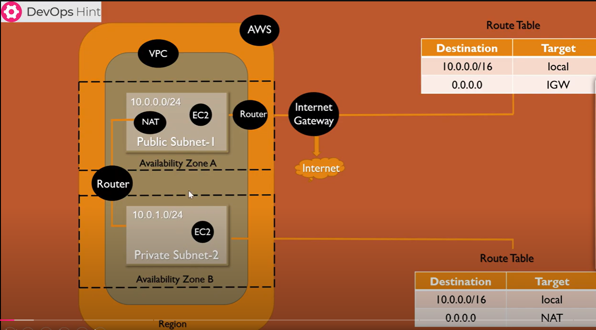

# AWS VPC and EC2 Infrastructure Setup with Terraform

## Overview

This project is designed to provision a foundational AWS infrastructure setup using Terraform. The infrastructure includes a Virtual Private Cloud (VPC) with both public and private subnets, as well as EC2 instances in each subnet. This setup can serve as a base environment for applications requiring secure and isolated networking within AWS.

## Infrastructure Components

- **VPC**: A dedicated virtual network to host AWS resources.
- **Public Subnet**: Hosts an EC2 instance accessible from the internet.
- **Private Subnet**: Hosts a separate EC2 instance without direct internet access, for enhanced security.

Each component is defined in Terraform configuration files, with modularity in mind to support scalability and reusability.

## Key Features

- **Modular Design**: The project uses Terraform modules for redundant resources, allowing for efficient reuse of code and simplified management.
- **Variable Configuration**: Each module includes `variables.tf` for customizable input variables, enhancing flexibility in resource configurations.
- **Output Values**: The `output.tf` file in each module provides essential information, such as instance IP addresses and subnet IDs, making it easy to reference outputs for further use.

## Prerequisites

- **Terraform**: Version 0.13 or higher
- **AWS Account**: With configured access credentials
- **SSH Key Pair**: For secure SSH access to the EC2 instance in the public subnet

## Project Image

You can include an architecture diagram or other related images by adding a photo link here. For example:

